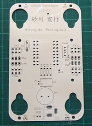
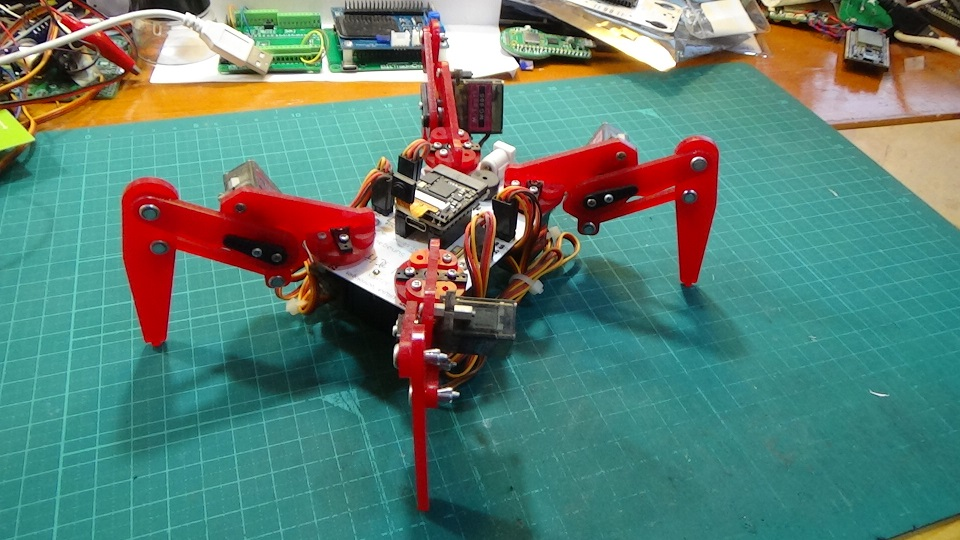
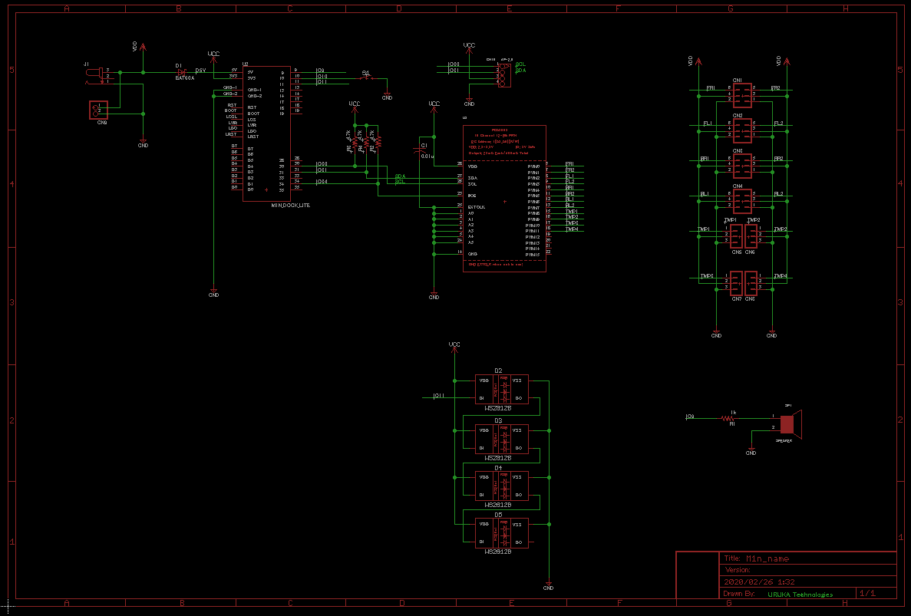

# M1n_name_card

砂川の個人名刺組立資料です

組立てると四足歩行ロボになります

# 回路図

# DEMO

組立後の動作画像
https://youtu.be/6SdT4taZKSw 
 
# Features

この名刺はクワッドクローラーの兄弟分です
https://bit-trade-one.co.jp/adcrbt/

# Requirement
 
Sipeed Maix NANO(N1n)　ラジオデパート1FのShigezoneで購入可能かも（品切れ必至）もしくはSeeedにて
https://www.shigezone.com/

サーボモータやロボットの脚などはビット・トレード・ワンでセットで購入可能
https://btoshop.jp/collections/educationrobot/products/adcr

# Author
Hiroyuki Sunagawa
